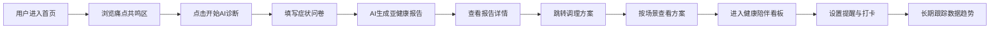

## 1. 产品概述
「中轻养计划」是一款面向 30–50 岁职场中年群体的一站式亚健康自查、干预、长期管理 AI 生活工具，解决中年人「没时间体检、不懂调理、作息饮食失控、肩颈失眠三高多发、没人监督坚持」全系列痛点，把碎片化养生方案变成可落地日常行动。
- 目标用户：30–50 岁职场中年人（久坐、高压、应酬、上有老下有小）
- 核心价值：用 AI 把杂乱养生信息去伪存真，输出适配碎片化时间的极简调理方案，实现温和可持续的日常健康管理

## 2. 核心功能

### 2.1 功能模块
1. **首页**：项目定位、痛点共鸣、三大核心模块入口、价值主张
2. **AI 诊断页**：轻量化症状问卷、作息饮食输入、体检报告上传、生成专属亚健康报告
3. **调理方案页**：工位 5 分钟修复操、一日简易食疗、分场景睡眠修复、应酬解酒护肝方案
4. **健康陪伴看板**：健康数据可视化、智能提醒、轻量化打卡、家庭联动

### 2.2 页面详情
| 页面名称 | 模块名称 | 功能描述 |
|-----------|-------------|---------------------|
| 首页 | Hero 主视觉区 | 品牌标语、中年亚健康核心痛点共鸣文案、开始诊断主 CTA |
| 首页 | 痛点共鸣区 | 五大亚健康类型卡片展示（颈椎劳损、睡眠障碍、代谢亚健康、压力焦虑、气血不足），引发用户共情 |
| 首页 | 三大模块入口 | AI 诊断 / 调理方案 / 健康陪伴 三大核心功能卡片导航 |
| 首页 | 差异化亮点 | 垂直中年赛道、低门槛无负担、AI 去伪存真、全链路 TRAE 实现四大亮点展示 |
| AI 诊断页 | 症状问卷 | 多步式问卷：身体症状选择、作息习惯、饮食情况、压力状态，支持体检报告照片上传 |
| AI 诊断页 | 报告生成 | 模拟 AI 分析过程，输出亚健康风险等级、五大类问题分层评估、短期预警与长期后果 |
| AI 诊断页 | 报告详情 | 风险雷达图、问题分类卡片、个性化建议摘要、跳转调理方案 |
| 调理方案页 | 场景切换 | 工位 / 居家 / 通勤 / 应酬 四大场景标签切换 |
| 调理方案页 | 工位修复操 | 5 分钟肩颈、腰椎、护眼动作卡片，步骤示范、时长提示 |
| 调理方案页 | 简易食疗 | 家常菜改良版食谱卡片，适配外卖与家常做饭，标注功效 |
| 调理方案页 | 睡眠修复 | 熬夜补救、入睡困难、多梦人群专属睡前流程时间轴 |
| 调理方案页 | 解酒护肝 | 应酬前中后护肝方案，高压解压短时放松动作 |
| 健康陪伴看板 | 数据概览 | 体重、睡眠时长、颈椎不适频率、情绪压力趋势四项数据卡片 |
| 健康陪伴看板 | 趋势图表 | 健康数据折线图可视化（睡眠、压力趋势对比） |
| 健康陪伴看板 | 智能提醒 | 喝水、拉伸、早睡、控糖、复查体检提醒列表，适配加班作息自定义 |
| 健康陪伴看板 | 打卡激励 | 低门槛每日任务打卡（温和可持续，不制造焦虑） |
| 健康陪伴看板 | 家庭联动 | 同步父母健康提醒，兼顾「顾自己 + 顾长辈」双重需求 |

## 3. 核心流程
用户进入首页 → 浏览痛点共鸣 → 点击「开始 AI 诊断」→ 进入症状问卷填写（多步式：症状→作息→饮食→压力→上传体检报告）→ AI 分析生成专属亚健康报告（风险等级+五大类分层评估）→ 查看报告详情 → 跳转调理方案页 → 按场景（工位/居家/通勤/应酬）查看极简调理方案 → 进入健康陪伴看板 → 设置智能提醒 + 每日打卡 → 长期跟踪健康数据趋势

## 4. 用户界面设计
### 4.1 设计风格
- **整体风格**：东方养生美学 + 现代极简，温润、专业、可信赖，避免普通健康 APP 的俗套设计
- **主色调**：墨绿 `#2D5043`（沉稳、养生、自然）+ 米白 `#F5F1E8`（温润、干净）+ 赭石 `#C97B4A`（点缀、活力、温暖）
- **辅助色**：浅墨绿 `#5A7A6E`、深棕 `#3D2E1F`、暖灰 `#8B7E6B`
- **按钮风格**：圆角胶囊按钮（主按钮墨绿底白字，次按钮描边款），柔和投影
- **字体**：标题用「思源宋体 / Noto Serif SC」（东方韵味、文化感），正文用「思源黑体 / Noto Sans SC」（现代清晰、易读）
- **布局风格**：卡片式布局，宽留白，不对称构图，呼吸感强
- **图标/emoji**：线性图标为主，搭配少量自然元素插画（草本、水滴、山石），避免卡通化

### 4.2 页面设计概览
| 页面名称 | 模块名称 | UI 元素 |
|-----------|-------------|-------------|
| 首页 | Hero 主视觉区 | 全屏左右分栏：左侧大标题宋体+痛点文案+CTA，右侧抽象山水墨绿渐变装饰，入场交错动画 |
| 首页 | 痛点共鸣区 | 五张卡片错落排列，悬停上浮+赭石描边，每卡含图标+痛点标题+描述 |
| 首页 | 三大模块入口 | 三大卡片横向排列，墨绿渐变背景，大数字编号+模块名+描述+箭头 |
| 首页 | 差异化亮点 | 四项亮点网格，米白底+赭石序号，简约线条分隔 |
| AI 诊断页 | 症状问卷 | 左侧步骤进度条，右侧问卷卡片：多选标签、滑块、单选项，体检报告上传区 |
| AI 诊断页 | 报告生成 | 居中加载动画（墨绿脉冲），进度文案「正在分析症状…正在评估风险…」 |
| AI 诊断页 | 报告详情 | 顶部风险等级横幅，左侧雷达图，右侧问题分类卡片列表，底部 CTA |
| 调理方案页 | 场景切换 | 顶部四个场景标签（工位/居家/通勤/应酬），选中墨绿底白字 |
| 调理方案页 | 方案卡片 | 网格卡片：动作图示+标题+时长+步骤，食疗卡片含食材标签+功效 |
| 调理方案页 | 睡眠修复 | 竖向时间轴：21:00→22:00→23:00，每节点含动作卡片 |
| 健康陪伴看板 | 数据概览 | 顶部四张数据卡片（数字+趋势箭头+迷你折线），墨绿/赭石配色 |
| 健康陪伴看板 | 趋势图表 | 大尺寸折线图卡片，图例+时间范围切换 |
| 健康陪伴看板 | 智能提醒 | 左侧提醒列表（图标+名称+时间+开关），右侧今日打卡圆形进度环 |
| 健康陪伴看板 | 家庭联动 | 底部父母健康提醒卡片，双人头像+提醒项+同步状态 |

### 4.3 响应式
- 桌面优先设计（1280px+ 基准），平板/移动端自适应
- 移动端：卡片单列堆叠，导航变为底部 Tab，问卷全屏分步
- 触控优化：按钮最小 44px 点击区域，滑块适配触屏

### 4.4 3D 场景指引（不适用）
本项目为 2D 界面，不使用 3D 场景。
