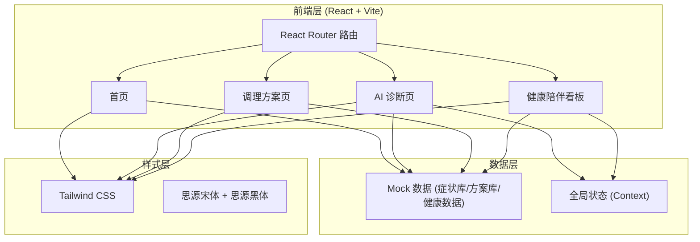
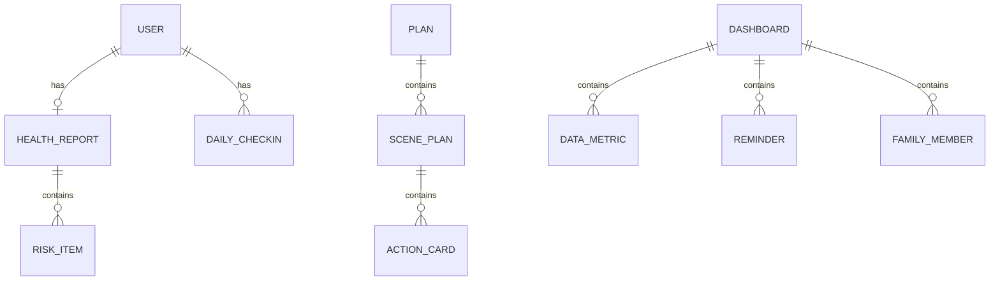

## 1. 架构设计
本项目为纯前端 Demo 原型，不依赖后端服务，使用 Mock 数据模拟 AI 诊断与健康数据，完整展示「中轻养计划」三大核心模块的交互与视觉。



## 2. 技术说明
- **前端框架**：React@18 + tailwindcss@3 + vite
- **初始化工具**：vite-init（`npm create vite@latest`）
- **路由**：react-router-dom@6（多页面切换）
- **图表库**：recharts（健康数据折线图、雷达图）
- **图标库**：lucide-react（线性图标）
- **动画**：framer-motion（入场动画、交互动效）
- **后端**：无（纯前端 Demo，使用 Mock 数据模拟）
- **数据库**：无（使用本地 Mock JSON 数据）

## 3. 路由定义
| 路由 | 用途 |
|-------|---------|
| `/` | 首页：项目定位、痛点共鸣、三大模块入口、差异化亮点 |
| `/diagnosis` | AI 诊断页：症状问卷填写、报告生成、报告详情展示 |
| `/plan` | 调理方案页：四大场景切换、修复操/食疗/睡眠/护肝方案 |
| `/dashboard` | 健康陪伴看板：数据概览、趋势图表、智能提醒、打卡、家庭联动 |

## 4. API 定义（不适用）
本项目为纯前端 Demo，无后端 API。所有 AI 诊断结果、调理方案、健康数据均为前端 Mock 数据，通过定时器模拟 AI 分析过程的加载动效。

## 5. 服务端架构（不适用）
纯前端项目，无服务端架构。

## 6. 数据模型
### 6.1 数据模型定义
Demo 使用前端 Mock 数据，核心数据结构如下：



### 6.2 数据定义
核心 Mock 数据结构（TypeScript 类型定义）：

```typescript
// 亚健康风险项
interface RiskItem {
  category: '颈椎劳损' | '睡眠障碍' | '代谢亚健康' | '压力焦虑' | '气血不足';
  level: '轻度' | '中度' | '重度';
  score: number;          // 0-100
  warning: string;        // 短期预警
  consequence: string;    // 长期后果
  advice: string;         // 个性化建议
}

// 健康报告
interface HealthReport {
  overallLevel: '良好' | '轻度风险' | '中度风险' | '高度风险';
  overallScore: number;
  riskItems: RiskItem[];
  summary: string;
}

// 调理方案动作卡片
interface ActionCard {
  id: string;
  title: string;
  duration: string;       // 时长，如 "5 分钟"
  steps: string[];        // 步骤说明
  effect: string;         // 功效
  icon: string;           // 图标名
}

// 场景方案
interface ScenePlan {
  scene: '工位' | '居家' | '通勤' | '应酬';
  category: '修复操' | '食疗' | '睡眠' | '护肝';
  actions: ActionCard[];
}

// 健康数据指标
interface DataMetric {
  name: string;           // 如 "睡眠时长"
  value: number;
  unit: string;
  trend: number[];        // 趋势数据
  change: string;         // 环比变化，如 "+0.3h"
}

// 智能提醒
interface Reminder {
  id: string;
  name: string;           // 如 "喝水"
  time: string;           // 如 "10:00"
  enabled: boolean;
  icon: string;
}

// 每日打卡任务
interface CheckinTask {
  id: string;
  name: string;
  completed: boolean;
  icon: string;
}

// 家庭成员
interface FamilyMember {
  name: string;
  relation: string;       // 如 "父亲"
  reminders: string[];
  synced: boolean;
}
```
